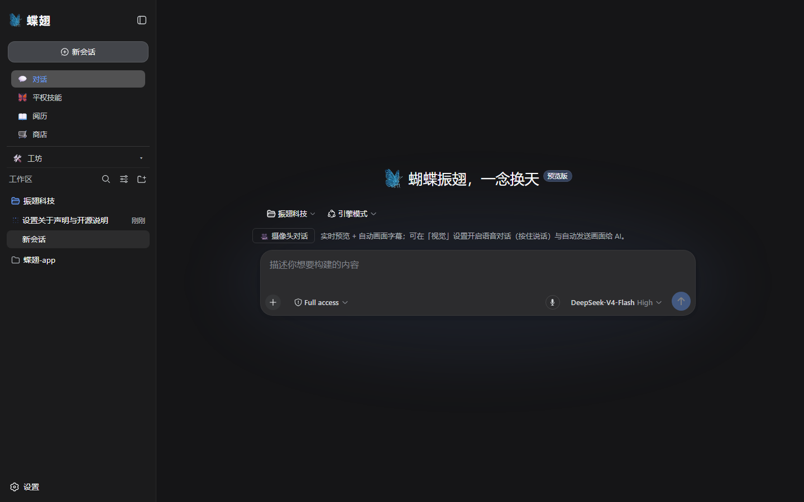
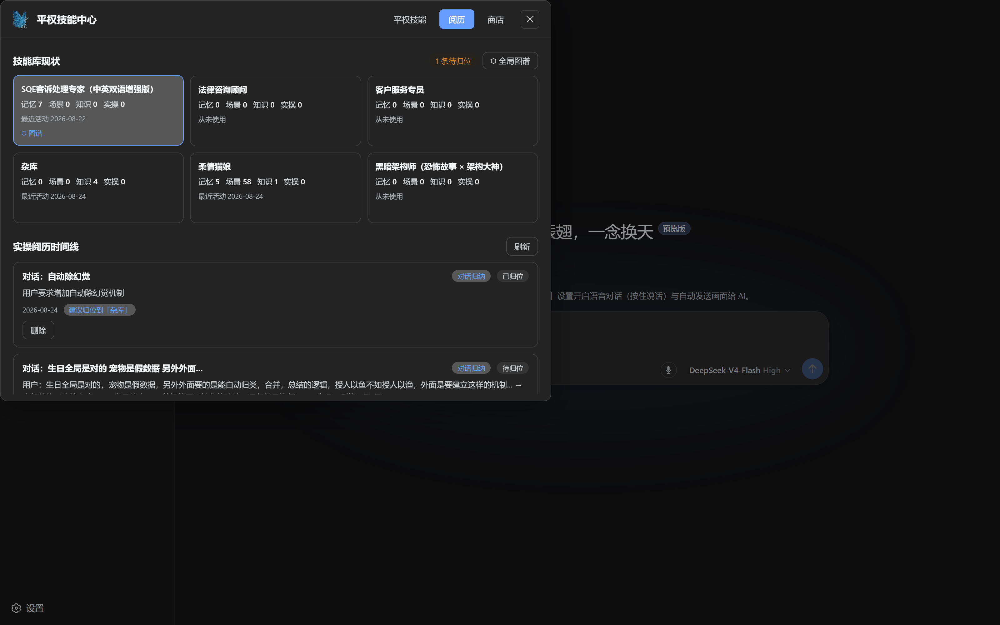
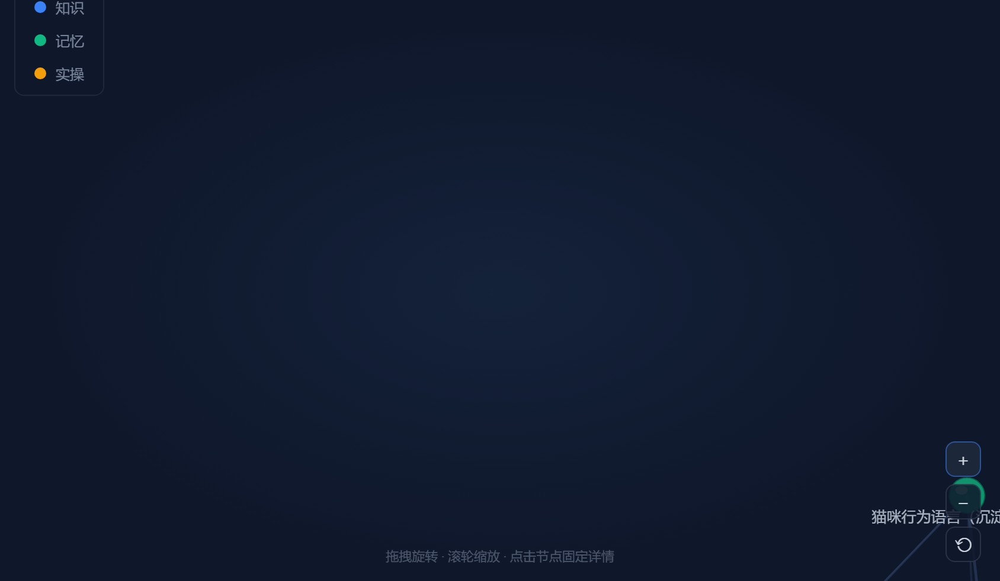
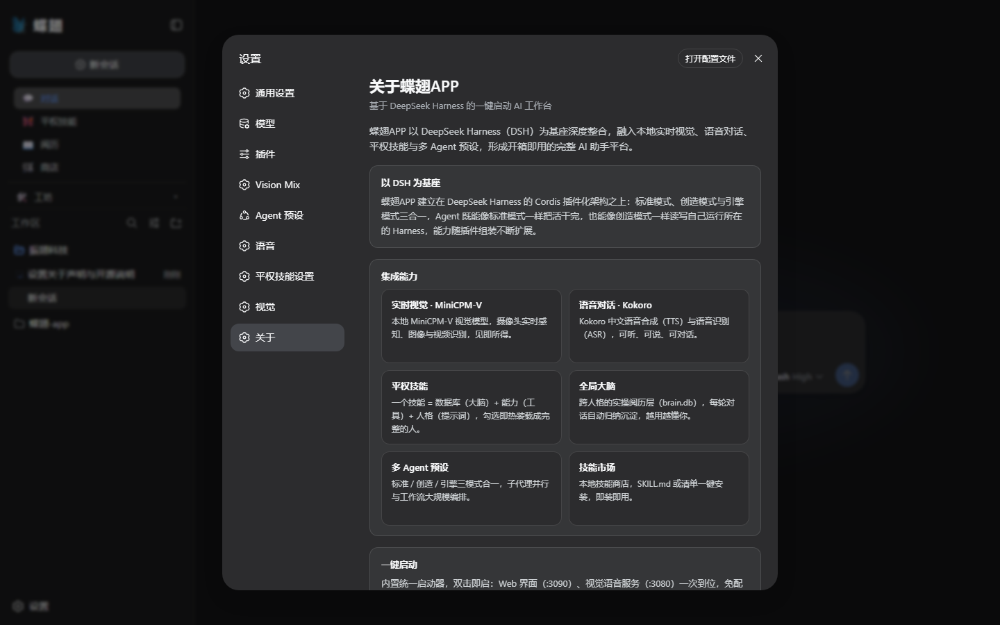

# 🦋 蝶翅APP · DeepSeek Harness (DSH) 改版整合版
# 🦋 Diechi APP — One-click Integrated Edition of DeepSeek Harness (DSH)

> **Diechi APP — a one-click integrated edition of DeepSeek Harness (DSH)**｜基于 DeepSeek Harness 基座改造的一键启动 AI 工作台 —— [GitHub 开源仓库](https://github.com/ggban666/deepseek-harness-diechi) | ⭐ Star 支持

[](https://github.com/deepseek-ai/deepseek-harness) [](LICENSE)

蝶翅APP 是基于 DeepSeek Harness（`dsh`）基座改造的**一键启动整合版**：以 DSH 为基座，融入 MiniCPM-V 本地实时视觉、Kokoro 语音、平权技能体系、全局大脑与多 Agent 预设，双击启动器即可体验开箱即用的完整 AI 助手平台。

**Diechi APP** is a **one-click integrated edition** built on the DeepSeek Harness (`dsh`) base: DSH as the foundation, blended with MiniCPM-V local real-time vision, Kokoro voice, an egalitarian skill system, a global brain and multi-agent presets. Double-click the launcher and a complete AI assistant platform is ready out of the box.

- 基座源码 / Base source：`diechi-harness/`（可改 / modifiable）
- 数据目录 / Data dir：`diechi-home/`（即 `$DSH_HOME`）
- 访问地址 / Web UI：http://127.0.0.1:3090/

## 🚀 一键安装：把链接扔给 AI / One-click Install: Send the Link to AI

把下面的链接复制给任意 AI 助手（DeepSeek / Claude / ChatGPT 等），它就能自动帮你完成安装：

Copy the link below and send it to any AI assistant (DeepSeek / Claude / ChatGPT, etc.) — it will install everything for you:

```
https://github.com/ggban666/deepseek-harness-diechi
```

AI 会自动执行：**克隆仓库 → 安装依赖 → 启动 Web（:3090）与视觉语音服务（:8080）**，开箱即用。

The AI will automatically: **clone the repo → install dependencies → launch Web (:3090) and the vision/voice service (:8080)** — ready to use.

## 📸 界面预览 / Screenshots

|  |  |
|---|---|
|  |  |
|  |  |

## 为什么强大 / Why Powerful

- **以 DSH 为基座**：完整保留 DeepSeek Harness 的 Cordis 插件化架构 —— 标准 / 创造 / 引擎三模式合一，Agent 可读写自身运行所在的 Harness。**Built on DSH**: full Cordis plugin architecture — Standard / Creator / Engine modes in one; the agent can read and write the very harness it runs in.
- **一键启动**：内置统一启动器，双击即启 —— Web 界面（:3090）与视觉语音服务（:8080）一次拉起，免配置。**One-click launch**: double-click the built-in launcher — Web UI (:3090) and vision/voice (:8080) come up at once, zero config.
- **本地实时视觉**：MiniCPM-V 本地推理（免费 / 隐私），也可一键切换云端视觉模型。**Local real-time vision**: MiniCPM-V runs locally (free / private), or switch to cloud vision models.
- **语音对话**：Kokoro 中文 TTS + ASR，可听、可说、可对话。**Voice**: Kokoro Chinese TTS + ASR — it listens, speaks and converses.
- **平权技能**：一个技能 = 数据库（大脑）+ 能力（工具）+ 人格（提示词），勾选即热装载成完整的人。**Egalitarian skills**: one skill = database (brain) + capability (tools) + persona (prompt); check it and a complete persona hot-loads.
- **全局大脑**：跨人格实操阅历层，对话自动归纳沉淀，越用越懂你。**Global brain**: cross-persona experience layer; conversations are distilled automatically.
- **多 Agent 预设**：标准 / 创造 / 引擎三模式，子代理并行与工作流编排。**Multi-agent presets** with parallel subagents and workflow orchestration.

## 核心概念：平权技能 / Core Concept: Egalitarian Skills

「平权技能」是蝶翅的特色，相当于一个可插拔的完整「人」。An egalitarian skill is a pluggable, complete "person":

| 组成 / Part | 实现 / Implementation | 位置 / Location |
| --- | --- | --- |
| 数据库（大脑）/ Brain | PersonBrain，SQLite（Node 内置 `node:sqlite`，零依赖） | `diechi-home/persons/<id>/brain.db` |
| 技能（能力）/ Capability | SkillManifestEntry v2 清单，`id` 即斜杠命令 | `diechi-home/settings.yaml` 的 `skill-store.skills` |
| 人格（提示词）/ Persona | persona.md / 技能正文 | `diechi-home/persons/<id>/persona.md` |

- 勾选即热装载，取消即热卸载，切换平权技能 = 切换一个完整的人。Check to hot-load, uncheck to hot-unload — switching skills is switching people.
- 对话过程中自动归纳（RAG）：每轮「用户问 + 助手答」结束自动沉淀入脑，数据库因使用而成长。Conversations are distilled (RAG) into the brain automatically, which grows with use.
- 视频投喂识别带 `#实操` 标签，与理论知识区分，自动入库并可归位到技能。Video feeding recognition tags `#实操` (practice), kept apart from theory, auto-archived and reassignable to skills.

## 功能总览 / Features

### 侧边导航 / Sidebar（4 项）
`对话 / 平权技能 / 阅历 / 商店`，收起为图标 rail。工坊在左侧可折叠面板。`Chat / Skills / Experience / Store`, collapses to an icon rail; the workshop is a left collapsible panel.

### 平权技能中心 / Skill Center（全屏）
- **卡片墙**：已安装技能卡片，勾选启用。Card wall: installed skill cards, check to enable.
- **阅历**：技能库现状 + 实操时间线（可视化）。Experience: skill inventory + practice timeline (visualized).
- **商店**：扫描本地 `diechi-home/skill-market/`，SKILL.md 或 JSON 清单一键安装。Store: scans the local skill market — one-click install from SKILL.md or JSON manifests.

### 全局图谱 / Global Knowledge Graph
- **全局图谱**：跨人格的知识 / 场景 / 实操图谱可视化，一眼看清你的「数字分身」都学会了什么。Visualize knowledge, scenes and practice across every persona — see at a glance what your digital avatars have learned.
- 每个平权技能（人格）都有独立图谱，可刷新 / 归位 / 删除。Every skill has its own graph; refresh, reassign and delete supported.

### 实时视觉 / Real-time Vision
- 视觉双通道：默认本地 MiniCPM-V-4.6（免费/隐私），也可切换云端 DeepSeek 看图模型等。Dual-channel vision: local MiniCPM-V-4.6 by default (free/privacy), switchable to cloud vision models.
- 实时摄像头对话 = 连续感知：前端每秒推帧进会话缓冲，回答带多帧记忆。Live camera conversation = continuous perception with multi-frame memory.
- 图片 / 视频投喂识别，直接生成技能草稿。Image/video recognition can directly generate skill drafts.

### 语音 / Voice
- Kokoro 中文 TTS + ASR（8080 端口）。
- 语音对话开关、自动朗读、语速可调。Voice chat toggle, auto-read, adjustable speed.

### 全局大脑与阅历控制台 / Global Brain & Experience Console
- 跨人格的实操阅历层（`diechi-home/brain.db`），不依赖人格勾选。Cross-persona practice experience layer, independent of persona checks.
- 视频实操自动入库、自动归类、可手动归位 / 改标签 / 删除。Auto-archive, auto-categorize, manual reassignment / re-tagging / deletion.

### 主题 / Theme
- 深浅色模式，跟随系统或手动，全局 token 统一。Light/dark mode following the system or manual; unified tokens.

## 目录结构 / Directory Layout

```
蝶翅-app/
├── diechi-harness/          # 蝶翅基座源码（基于 DSH 改造，可改）/ base source
│   ├── apps/web/            # 前端壳（vite 构建 → dist/）/ web shell
│   ├── apps/cli/            # dsh 命令入口 / CLI entry
│   ├── packages/client/     # 浏览器侧插件 / browser plugins
│   │   ├── ui-skill-store/      # 平权技能中心全部 UI
│   │   ├── ui-diechi-brain/     # 阅历控制台 / experience console
│   │   └── ui-sidebar/          # 侧边导航 slot 改造
│   ├── packages/host/       # Node 侧插件 / host plugins
│   │   ├── skill-store/         # 平权技能目录 + PersonBrain + 工具
│   │   └── diechi-brain/        # 全局大脑（实操阅历层）/ global brain
│   └── packages/bundle/web-app/ # web 表层 bundle
├── diechi-home/             # 数据目录（$DSH_HOME）/ data dir
├── deploy-tools/            # 启动器、vision-server.py、check-health.ps1
├── docs/                    # 项目文档 / docs
├── 蝶翅APP启动器.cmd        # 统一启动管理器 / unified launcher
└── README.md
```

## 启动 / Launch

### 推荐：统一启动器 / Recommended: Unified Launcher
双击 `蝶翅APP启动器.cmd`，统一管理：Double-click `蝶翅APP启动器.cmd`:
- 蝶翅APP基座（3090）
- 视觉语音服务（8080，`deploy-tools/vision-server.py`）
- 原版 Harness（3080，可选）

最小启动 / Minimal: `deploy-tools/start-diechi.cmd`。

### 手动启动 / Manual
```bat
set DSH_HOME=D:\桌面\振翅科技\蝶翅-app\diechi-home
cd D:\桌面\振翅科技\蝶翅-app\diechi-harness
pnpm dsh web --port 3090
```

### 健康自检 / Health Check
`deploy-tools/check-health.ps1`：检查 3090 模型供应商齐全、8080 视觉语音正常。

## 开发与构建 / Development

在 `diechi-harness/` 下执行 / Under `diechi-harness/`:

```sh
pnpm install                # 首次 / first time
pnpm run build:lib:host     # host 插件（Node 侧）/ host plugins
pnpm run build:lib:client   # client 插件（浏览器侧）/ browser plugins
pnpm run build:web          # 前端壳 apps/web/dist / web shell
pnpm run build              # 以上全部 / all above
```

## 模型供应商 / Model Providers

- 配置集中在 `diechi-home/settings.yaml` 的 `llm-pi-ai.providers`。Config lives in `diechi-home/settings.yaml` → `llm-pi-ai.providers`.
- 视觉：云端 OpenAI 兼容通道（默认 DeepSeek，可换 GLM-4.5V / qwen-vl-max / Kimi）。Vision: cloud OpenAI-compatible channel.
- 云端：abl、Agnes 等（API Key 走环境变量）。Cloud providers via env API keys.
- 默认对话模型：`agnes-2.5-flash`。Default chat model: `agnes-2.5-flash`.

## 注意事项 / Notes

- DSH 官方处于 developer preview，升级基座可能破坏兼容性，建议锁定版本。DSH is in developer preview — lock the version, upgrade with care.
- 当前专注桌面端打磨。Currently focused on desktop polish.
