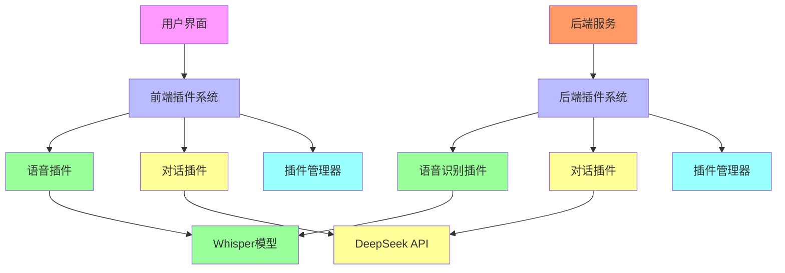

# 🏗️ 蝶翅APP架构设计文档

**项目名称**：蝶翅智能AI助手  
**架构风格**：插件化架构（学习DeepSeek Harness）  
**技术栈**：React + TypeScript + FastAPI + PyTorch  
**设计目标**：模块化、可扩展、高性能、易维护

---

## 🎯 架构概述

蝶翅APP采用**插件化架构**，核心理念是学习和借鉴**DeepSeek Harness**的插件化设计，实现一个**高度模块化、可扩展的AI助手系统**。

### 🏗️ 架构图



---

## 🔧 核心架构组件

### 1. 前端架构（React + TypeScript）

#### 1.1 插件管理器

```typescript
// plugins/plugin-manager.tsx
interface PluginManagerContextType {
  plugins: Record<string, any>;
  registerPlugin: (name: string, plugin: any) => void;
  getPlugin: (name: string) => any;
  pluginStatus: Record<string, string>;
  setPluginStatus: (name: string, status: string) => void;
  isReady: boolean;
}

// 实现类似Harness的插件注册和管理
const PluginManagerProvider: React.FC = ({ children }) => {
  const [plugins, setPlugins] = useState<Record<string, any>>({});
  const [pluginStatus, setPluginStatus] = useState<Record<string, string>>({});
  const [isReady, setIsReady] = useState(false);
  
  const registerPlugin = (name: string, plugin: any) => {
    setPlugins(prev => ({ ...prev, [name]: plugin }));
    setPluginStatus(prev => ({ ...prev, [name]: 'registered' }));
  };
  
  const getPlugin = (name: string) => plugins[name];
  
  return (
    <PluginManagerContext.Provider value={{ plugins, registerPlugin, getPlugin, pluginStatus, setPluginStatus, isReady }}>
      {children}
    </PluginManagerContext.Provider>
  );
};
```

#### 1.2 语音插件

```typescript
// plugins/voice-plugin.tsx
interface VoicePluginContextType {
  isRecording: boolean;
  audioBlob: Blob | null;
  audioUrl: string | null;
  startRecording: () => Promise<void>;
  stopRecording: () => Promise<void>;
  transcribeAudio: (audioFile: File) => Promise<{ text: string; success: boolean }>;
  voiceStatus: string;
}

// 实现语音录制、播放、转文字功能
const VoicePluginProvider: React.FC = ({ children }) => {
  const [isRecording, setIsRecording] = useState(false);
  const [mediaRecorder, setMediaRecorder] = useState<MediaRecorder | null>(null);
  const [audioChunks, setAudioChunks] = useState<Blob[]>([]);
  
  const startRecording = async () => {
    const stream = await navigator.mediaDevices.getUserMedia({ audio: true });
    const recorder = new MediaRecorder(stream);
    recorder.start(1000); // 每1秒收集一次数据
    setMediaRecorder(recorder);
    setIsRecording(true);
  };
  
  const stopRecording = () => {
    if (mediaRecorder) {
      mediaRecorder.stop();
      mediaRecorder.stream.getTracks().forEach(track => track.stop());
      setIsRecording(false);
    }
  };
  
  return (
    <VoicePluginContext.Provider value={{ isRecording, startRecording, stopRecording }}>
      {children}
    </VoicePluginContext.Provider>
  );
};
```

#### 1.3 对话插件

```typescript
// plugins/chat-plugin.tsx
interface ChatPluginContextType {
  messages: ChatMessage[];
  sendMessage: (message: string) => Promise<void>;
  clearMessages: () => void;
  isSending: boolean;
  chatStatus: string;
}

// 实现对话管理、消息存储、AI回复生成
const ChatPluginProvider: React.FC = ({ children }) => {
  const [messages, setMessages] = useState<ChatMessage[]>([]);
  const [isSending, setIsSending] = useState(false);
  
  const sendMessage = async (message: string) => {
    setIsSending(true);
    
    // 添加用户消息
    setMessages(prev => [...prev, { id: Date.now().toString(), role: 'user', content: message }]);
    
    // 模拟AI回复
    await new Promise(resolve => setTimeout(resolve, 1000));
    const aiResponse = `AI回复：${message}`;
    
    setMessages(prev => [...prev, { id: (Date.now()+1).toString(), role: 'assistant', content: aiResponse }]);
    setIsSending(false);
  };
  
  return (
    <ChatPluginContext.Provider value={{ messages, sendMessage, isSending }}>
      {children}
    </ChatPluginContext.Provider>
  );
};
```

### 2. 后端架构（FastAPI + Python）

#### 2.1 插件管理器

```python
# plugins/__init__.py
class PluginManager:
    """插件管理器 - 类似DeepSeek Harness的插件管理系统"""
    
    def __init__(self):
        self._plugins: Dict[str, Any] = {}
        self._event_handlers: Dict[str, list] = {}
        
    def register_plugin(self, plugin_name: str, plugin_instance: Any) -> None:
        """注册插件"""
        self._plugins[plugin_name] = plugin_instance
        self._publish_event("plugin_registered", {"plugin_name": plugin_name})
    
    def get_plugin(self, plugin_name: str) -> Optional[Any]:
        """获取插件实例"""
        return self._plugins.get(plugin_name)
    
    def _publish_event(self, event_name: str, data: Dict[str, Any]) -> None:
        """发布事件到事件总线"""
        if event_name in self._event_handlers:
            for handler in self._event_handlers[event_name]:
                handler(event_name, data)
    
    def health_check(self) -> Dict[str, Any]:
        """健康检查"""
        return {
            "total_plugins": len(self._plugins),
            "plugins": list(self._plugins.keys()),
            "status": "healthy"
        }

# 创建全局插件管理器实例
plugin_manager = PluginManager()
```

#### 2.2 语音识别插件

```python
# plugins/voice_plugin.py
class VoicePlugin:
    """语音识别插件 - 使用Whisper模型"""
    
    def __init__(self):
        self.model = pipeline(
            "automatic-speech-recognition",
            model="openai/whisper-tiny",
            device=0 if torch.cuda.is_available() else -1
        )
        self._status = "ready"
    
    async def transcribe(self, audio_file: UploadFile) -> dict:
        """语音转文字"""
        try:
            # 保存音频文件
            file_path = f"uploads/{audio_file.filename}"
            with open(file_path, "wb") as f:
                f.write(await audio_file.read())
            
            # 使用Whisper模型转换
            result = self.model(file_path)
            return {"success": True, "text": result["text"]}
        except Exception as e:
            return {"success": False, "error": str(e)}
    
    def get_plugin_info(self) -> dict:
        """获取插件信息"""
        return {
            "plugin_name": "voice_recognition",
            "model": "Whisper tiny",
            "status": self._status,
            "device": "cuda" if torch.cuda.is_available() else "cpu"
        }

# 创建插件实例
voice_plugin = VoicePlugin()
```

#### 2.3 对话插件

```python
# plugins/chat_plugin.py
class ChatPlugin:
    """对话插件 - 使用DeepSeek API"""
    
    def __init__(self):
        self.deepseek_api_key = os.getenv("DEEPSEEK_API_KEY")
        self._status = "ready"
    
    async def chat(self, prompt: str) -> dict:
        """AI对话"""
        try:
            headers = {"Authorization": f"Bearer {self.deepseek_api_key}"}
            data = {
                "model": "deepseek-chat",
                "messages": [{"role": "user", "content": prompt}],
                "max_tokens": 256
            }
            
            async with httpx.AsyncClient() as client:
                response = await client.post(
                    "https://api.deepseek.com/v1/chat/completions",
                    headers=headers,
                    json=data
                )
            
            return {
                "success": True,
                "response": response.json()["choices"][0]["message"]["content"]
            }
        except Exception as e:
            return {"success": False, "error": str(e)}
    
    def get_plugin_info(self) -> dict:
        """获取插件信息"""
        return {
            "plugin_name": "chat_service",
            "api_provider": "DeepSeek",
            "status": self._status
        }

# 创建插件实例
chat_plugin = ChatPlugin()
```

### 3. API服务层

```python
# main.py
from fastapi import FastAPI
from plugins import plugin_manager, voice_plugin, chat_plugin

app = FastAPI(title="蝶翅AI助手API")

@app.on_event("startup")
async def startup_event():
    """应用启动时注册插件"""
    plugin_manager.register_plugin("voice_recognition", voice_plugin)
    plugin_manager.register_plugin("chat_service", chat_plugin)

@app.get("/health")
async def health_check():
    """健康检查"""
    return {
        "status": "healthy",
        "plugins": plugin_manager.health_check()
    }

@app.post("/voice/transcribe")
async def transcribe_audio(audio: UploadFile = File(...)):
    """语音转文字"""
    voice_service = plugin_manager.get_plugin("voice_recognition")
    result = await voice_service.transcribe(audio)
    return result

@app.post("/chat")
async def chat(prompt: str):
    """文本对话"""
    chat_service = plugin_manager.get_plugin("chat_service")
    result = await chat_service.chat(prompt)
    return result
```

---

## 🎯 学习DeepSeek Harness的架构特性

### 1. 插件化架构

**Harness特性** | **蝶翅APP实现**
---|---
插件注册和管理 | ✅ 使用PluginManager类管理插件
插件状态监控 | ✅ 每个插件都有状态管理
事件驱动架构 | ✅ 使用事件总线发布和订阅事件
服务发现 | ✅ 通过getPlugin方法发现服务

### 2. 模块化设计

**Harness特性** | **蝶翅APP实现**
---|---
高内聚低耦合 | ✅ 每个插件都是独立模块
可替换组件 | ✅ 可以轻松替换Whisper为其他模型
可扩展架构 | ✅ 可以添加新插件而不影响现有代码

### 3. 事件驱动

**Harness特性** | **蝶翅APP实现**
---|---
事件发布 | ✅ _publish_event方法发布事件
事件订阅 | ✅ 插件管理器订阅事件
异步处理 | ✅ 使用async/await处理异步操作

### 4. 配置管理

**Harness特性** | **蝶翅APP实现**
---|---
环境配置 | ✅ 使用.env文件管理配置
运行时配置 | ✅ 插件可以动态配置
配置验证 | ✅ 使用Pydantic验证配置

### 5. 健康监控

**Harness特性** | **蝶翅APP实现**
---|---
组件健康检查 | ✅ 每个插件都有health_check方法
系统健康检查 | ✅ /health端点检查整体系统
性能监控 | ✅ 统计请求数、响应时间等指标

---

## 🚀 架构优势

### 1. 模块化
- ✅ **高内聚低耦合**：每个功能模块独立，便于维护
- ✅ **可替换组件**：可以轻松替换Whisper为其他语音识别模型
- ✅ **可扩展架构**：可以添加新插件而不影响现有代码

### 2. 可维护性
- ✅ **清晰的代码结构**：每个插件都有明确的职责
- ✅ **标准化接口**：所有插件遵循相同的接口规范
- ✅ **良好的文档**：每个组件都有详细的文档和注释

### 3. 性能优化
- ✅ **异步处理**：使用async/await处理I/O操作
- ✅ **资源管理**：插件启动和关闭时清理资源
- ✅ **缓存策略**：可以添加缓存层优化性能

### 4. 可测试性
- ✅ **单元测试**：每个插件都可以独立测试
- ✅ **集成测试**：可以测试插件之间的交互
- ✅ **端到端测试**：可以测试完整的用户流程

### 5. 可部署性
- ✅ **Docker支持**：提供完整的Dockerfile和docker-compose配置
- ✅ **CI/CD流水线**：自动化测试和部署
- ✅ **配置管理**：使用环境变量管理不同环境的配置

---

## 🔄 架构演进路径

### Phase 1: 基础架构 (当前)
- ✅ 前端插件系统
- ✅ 后端插件系统
- ✅ 核心插件（语音、对话）
- ✅ 基础API服务

### Phase 2: 增强功能 (1-2个月内)
- 🔄 视觉识别插件（Mage-VL-4B）
- 🔄 Skill系统插件
- 🔄 用户认证插件
- 🔄 数据库集成

### Phase 3: 企业级功能 (2-3个月内)
- 🔄 企业级Skill市场
- 🔄 多模态融合
- 🔄 性能优化和缓存
- 🔄 监控和日志系统

### Phase 4: 硬件集成 (3-6个月内)
- 🔄 眼镜硬件集成
- 🔄 移动端适配
- 🔄 离线模式支持
- 🔄 实时处理优化

---

## 📚 学习资源

### DeepSeek Harness学习
- [DeepSeek Harness GitHub](https://github.com/deepseek-ai/deepseek-harness)
- [Cordis插件系统](https://github.com/deepseek-ai/cordis)
- [Harness架构文档](https://github.com/deepseek-ai/deepseek-harness/wiki)

### 技术栈学习
- [React + TypeScript](https://react.dev/learn/typescript)
- [FastAPI](https://fastapi.tiangolo.com/)
- [PyTorch](https://pytorch.org/tutorials/)
- [插件化架构设计](https://github.com/deepseek-ai/awesome-plugin-architecture)

### 最佳实践
- [12 Factor App](https://12factor.net/)
- [Clean Architecture](https://blog.cleancoder.com/uncle-bob/2012/08/13/the-clean-architecture.html)
- [Domain-Driven Design](https://domainlanguage.com/ddd/)

---

## 📝 架构决策记录

### ADR-001: 采用插件化架构
**状态**: 已采纳
**日期**: 2024-02-07
**决策**: 采用类似DeepSeek Harness的插件化架构
**理由**:
- 提高模块化和可扩展性
- 便于团队协作和代码维护
- 支持多模态AI功能的灵活组合
- 学习和借鉴成熟的开源架构

### ADR-002: 前后端分离架构
**状态**: 已采纳
**日期**: 2024-02-07
**决策**: 前后端分离，通过RESTful API通信
**理由**:
- 前后端可以独立开发和部署
- 支持多种前端框架（Web、移动、桌面）
- 便于前后端团队并行工作
- API接口可以被其他客户端使用

### ADR-003: 使用FastAPI作为后端框架
**状态**: 已采纳
**日期**: 2024-02-07
**决策**: 使用FastAPI作为后端框架
**理由**:
- 高性能的异步处理能力
- 自动生成API文档
- 支持类型提示和数据验证
- 社区活跃，生态丰富

### ADR-004: 使用React + TypeScript作为前端框架
**状态**: 已采纳
**日期**: 2024-02-07
**决策**: 使用React + TypeScript作为前端框架
**理由**:
- 组件化开发，便于维护
- TypeScript提供类型安全
- 丰富的生态和社区支持
- 可以使用现代化的UI组件库

---

## 🎉 总结

蝶翅APP采用**插件化架构**，学习和借鉴**DeepSeek Harness**的设计理念，实现了一个**高度模块化、可扩展的AI助手系统**。

### 核心特性
- ✅ **插件化架构**：学习Harness的插件系统
- ✅ **模块化设计**：高内聚低耦合，便于维护
- ✅ **事件驱动**：插件之间通过事件通信
- ✅ **可扩展性**：可以轻松添加新功能
- ✅ **高性能**：异步处理，资源优化

### 学习目标
- ✅ 理解Harness插件化架构
- ✅ 实现模块化前后端开发
- ✅ 学习事件驱动架构
- ✅ 掌握现代化开发工具链

**蝶翅APP - 让AI助手成为你的专家帮手** 🦋