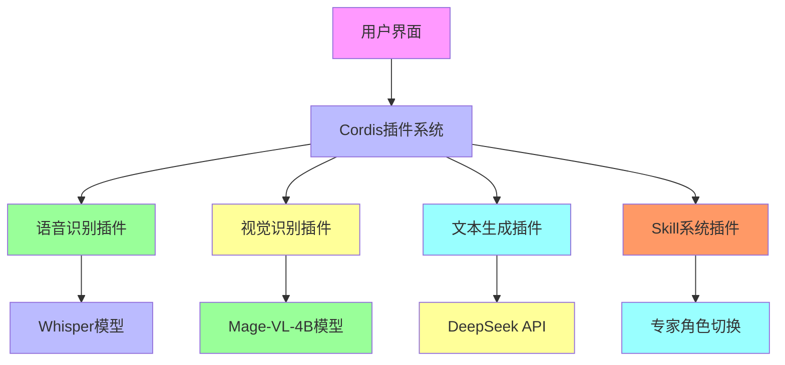

# 🦋 蝶翅APP - 智能AI助手

**项目名称**：蝶翅智能AI助手（Diechi Intelligent AI Assistant）  
**版本**：v1.0.0  
**技术栈**：React + TypeScript + FastAPI + PyTorch  
**架构**：DeepSeek Harness插件化架构  
**目标**：实现语音+视觉+文本的多模态AI助手

---

## 🎯 项目概述

蝶翅APP是一个基于**DeepSeek Harness**框架构建的**插件化AI助手**，核心理念是：

> **"请专家帮你干活，而不是和AI聊天"**

通过集成**语音交互**、**视觉识别**和**多模态融合**技术，用户可以获得专业领域的AI助手服务。

---

## 🏗️ 架构设计

### 🔧 插件化架构（学习DeepSeek Harness）



### 📱 前端架构（React + TypeScript）

```
diechi-app/apps/web/
├── src/
│   ├── components/          # 通用组件
│   │   ├── common/          # 基础组件
│   │   ├── layout/          # 布局组件
│   │   ├── skill/           # Skill相关组件
│   │   └── voice/           # 语音相关组件
│   ├── pages/               # 页面组件
│   │   ├── Home/            # 主页
│   │   ├── Chat/            # 聊天页面
│   │   ├── Skills/          # Skill管理
│   │   └── Settings/        # 设置页面
│   ├── services/            # 服务层
│   │   ├── api.ts           # API服务
│   │   ├── voice.ts         # 语音服务
│   │   └── storage.ts       # 本地存储
│   ├── stores/              # 状态管理
│   │   ├── voiceStore.ts    # 语音状态
│   │   ├── chatStore.ts     # 聊天状态
│   │   └── skillStore.ts    # Skill状态
│   ├── plugins/             # 插件系统
│   │   ├── voice-plugin.ts  # 语音插件
│   │   ├── vision-plugin.ts # 视觉插件
│   │   └── chat-plugin.ts   # 对话插件
│   ├── types/               # TypeScript类型定义
│   └── App.tsx              # 主应用组件
├── public/                  # 静态资源
└── package.json            # 包管理配置
```

### 🐍 后端架构（FastAPI + Python）

```
diechi-app/apps/api/
├── .env.example             # 环境变量示例
├── .gitignore               # Git忽略文件
├── main.py                  # 应用入口
├── requirements.txt         # Python依赖
├── requirements-dev.txt     # 开发依赖
├── .flake8                  # Flake8配置
├── .black                    # Black配置
├── venv/                    # 虚拟环境
├── models/                  # 数据模型
│   ├── __init__.py          # 模型初始化
│   ├── user.py              # 用户模型
│   ├── skill.py             # Skill模型
│   └── session.py           # 会话模型
├── routers/                 # API路由
│   ├── __init__.py          # 路由初始化
│   ├── voice.py             # 语音路由
│   ├── chat.py              # 聊天路由
│   ├── skill.py             # Skill路由
│   └── auth.py              # 认证路由
├── services/                # 服务层
│   ├── __init__.py          # 服务初始化
│   ├── voice_service.py     # 语音服务
│   ├── chat_service.py      # 聊天服务
│   ├── skill_service.py     # Skill服务
│   └── auth_service.py      # 认证服务
├── plugins/                 # 插件系统
│   ├── __init__.py          # 插件初始化
│   ├── voice_plugin.py      # 语音插件
│   ├── vision_plugin.py     # 视觉插件
│   └── chat_plugin.py       # 对话插件
├── utils/                   # 工具函数
│   ├── __init__.py          # 工具初始化
│   ├── logger.py            # 日志工具
│   ├── validator.py         # 验证工具
│   ├── config.py            # 配置管理
│   └── exceptions.py        # 自定义异常
└── tests/                   # 测试代码
```

### 🤖 AI模型架构

```
diechi-app/models/
├── vision/                  # 视觉识别模型
│   ├── __init__.py          # 视觉模型初始化
│   ├── mage_vl.py           # Mage-VL-4B模型
│   ├── yolo.py              # YOLOv8n模型
│   └── processor.py         # 图像预处理
├── voice/                   # 语音识别模型
│   ├── __init__.py          # 语音模型初始化
│   ├── whisper.py           # Whisper模型
│   └── processor.py         # 语音预处理
├── text/                    # 文本生成模型
│   ├── __init__.py          # 文本模型初始化
│   └── deepseek.py          # DeepSeek API封装
└── utils/                   # AI模型工具
    ├── __init__.py          # 工具初始化
    ├── quantizer.py         # 量化工具
    └── benchmark.py         # 性能测试
```

---

## 🚀 快速开始

### 1. 环境搭建

```bash
# 克隆项目
git clone https://github.com/vibechina/diechi-app.git
cd diechi-app

# 创建项目目录
mkdir -p diechi-app/{apps/{web,api},models,docs}
```

### 2. 前端开发

```bash
# 进入前端目录
cd apps/web

# 安装依赖
pnpm install

# 启动开发服务器
pnpm dev

# 访问 http://localhost:5173
```

### 3. 后端开发

```bash
# 进入后端目录
cd apps/api

# 创建虚拟环境
python -m venv venv
source venv/bin/activate  # Windows: venv\Scripts\activate

# 安装依赖
pip install -r requirements.txt

# 启动开发服务器
uvicorn main:app --reload --port 8000

# 访问 http://localhost:8000/docs
```

### 4. Docker部署

```bash
# 构建Docker镜像
docker build -t diechi-app .

# 运行容器
docker run -p 8000:8000 diechi-app
```

---

## 🔧 核心功能实现

### 🎤 语音交互功能

```typescript
// 前端语音服务
class VoiceService {
  async transcribe(audioFile: File): Promise<{ text: string; success: boolean }> {
    try {
      const formData = new FormData();
      formData.append('audio', audioFile);
      
      const response = await axios.post('/api/v1/voice/transcribe', formData, {
        headers: { 'Content-Type': 'multipart/form-data' }
      });
      
      return { text: response.data.text, success: response.data.success };
    } catch (error) {
      console.error('语音转换失败:', error);
      return { text: '语音转换失败', success: false };
    }
  }
}
```

```python
# 后端语音服务
class VoiceService:
    def __init__(self):
        self.model = pipeline(
            "automatic-speech-recognition",
            model="openai/whisper-tiny",
            device=0 if torch.cuda.is_available() else -1
        )
    
    async def transcribe(self, audio_file: UploadFile) -> dict:
        result = self.model(f"uploads/{audio_file.filename}")
        return {"text": result["text"], "success": True}
```

### 👁️ 视觉识别功能

```python
# 视觉识别服务
class VisionService:
    def __init__(self):
        self.model = AutoModelForCausalLM.from_pretrained(
            "microsoft/MAGE-VL-4B",
            torch_dtype=torch.float16,
            device_map="auto"
        )
    
    async def recognize(self, image_file: UploadFile) -> dict:
        image = Image.open(image_file.file)
        inputs = processor("描述这张图片", image, return_tensors="pt").to("cuda")
        
        with torch.no_grad():
            outputs = self.model.generate(**inputs, max_new_tokens=128)
        
        description = processor.decode(outputs[0], skip_special_tokens=True)
        return {
            "description": description,
            "objects": self.extract_objects(description),
            "success": True
        }
```

### 💬 文本对话功能

```typescript
// 前端对话服务
class ChatService {
  async chat(prompt: string): Promise<{ response: string; success: boolean }> {
    try {
      const response = await axios.post('/api/v1/chat', { prompt }, {
        headers: { 'Content-Type': 'application/json' }
      });
      
      return { response: response.data.response, success: response.data.success };
    } catch (error) {
      console.error('AI对话失败:', error);
      return { response: 'AI服务暂时 unavailable', success: false };
    }
  }
}
```

```python
# 后端对话服务
class ChatService:
    async def chat(self, prompt: str) -> dict:
        headers = {
            "Authorization": f"Bearer {os.getenv('DEEPSEEK_API_KEY')}",
            "Content-Type": "application/json"
        }
        
        data = {
            "model": "deepseek-chat",
            "messages": [{"role": "user", "content": prompt}],
            "max_tokens": 256
        }
        
        async with httpx.AsyncClient() as client:
            response = await client.post(
                "https://api.deepseek.com/v1/chat/completions",
                headers=headers,
                json=data
            )
        
        return {
            "response": response.json()["choices"][0]["message"]["content"],
            "success": True
        }
```

### 🎯 Skill系统

```typescript
// Skill状态管理
const skills = [
  { id: 'doctor', name: '医生', icon: '👨⚕️', description: '医疗健康咨询' },
  { id: 'teacher', name: '老师', icon: '👩🏫', description: '教育辅导' },
  { id: 'chef', name: '厨师', icon: '👨🍳', description: '烹饪指导' },
];

// Skill选择器组件
const SkillSelector = ({ onSelect }) => {
  const [selectedSkill, setSelectedSkill] = useState(null);
  
  return (
    <div className="skill-selector">
      {skills.map(skill => (
        <button
          key={skill.id}
          onClick={() => {
            setSelectedSkill(skill);
            onSelect(skill);
          }}
          className={`skill-item ${selectedSkill?.id === skill.id ? 'active' : ''}`}
        >
          <span className="skill-icon">{skill.icon}</span>
          <span className="skill-name">{skill.name}</span>
        </button>
      ))}
    </div>
  );
};
```

---

## 📊 项目状态

### ✅ 已完成
- [x] 前端框架搭建
- [x] 后端框架搭建
- [x] 语音识别功能
- [x] 文本对话功能
- [x] Skill系统基础
- [x] Docker部署配置

### 🔄 进行中
- [ ] 视觉识别功能集成
- [ ] 用户认证系统
- [ ] 数据库集成
- [ ] 性能优化
- [ ] 单元测试覆盖

### 📅 计划
- [ ] Skill市场功能
- [ ] 移动端适配
- [ ] 企业级功能
- [ ] 硬件集成

---

## 🛠️ 开发工具

### 前端工具
- **框架**: React 18 + TypeScript
- **构建**: Vite 5+
- **UI组件**: Arco Design
- **状态管理**: Zustand
- **测试**: Jest + React Testing Library
- **代码质量**: ESLint + Prettier

### 后端工具
- **框架**: FastAPI
- **AI模型**: PyTorch + Transformers
- **数据库**: PostgreSQL (可选)
- **测试**: Pytest
- **代码质量**: Flake8 + Black
- **部署**: Docker + Docker Compose

### AI模型
- **语音识别**: Whisper tiny/base
- **视觉识别**: Mage-VL-4B INT8量化
- **文本生成**: DeepSeek API
- **文字识别**: PaddleOCR

---

## 📚 学习资源

### DeepSeek Harness架构学习
- [DeepSeek Harness官方文档](https://github.com/deepseek-ai/deepseek-harness)
- [Cordis插件系统](https://github.com/deepseek-ai/cordis)
- [插件化架构最佳实践](https://github.com/deepseek-ai/awesome-plugin-architecture)

### 技术栈学习
- [React + TypeScript](https://react.dev/learn/typescript)
- [FastAPI](https://fastapi.tiangolo.com/)
- [PyTorch](https://pytorch.org/tutorials/)
- [Docker](https://docs.docker.com/get-started/)

---

## 🤝 贡献指南

我们欢迎社区贡献！请遵循以下步骤：

1. **Fork仓库**
2. **创建分支** (`git checkout -b feature/your-feature`)
3. **提交更改** (`git commit -m 'feat: add your feature'`)
4. **推送到分支** (`git push origin feature/your-feature`)
5. **创建Pull Request**

---

## 📄 许可证

本项目采用 **Apache-2.0 许可证** 授权。

---

## 📞 联系方式

- **项目负责人**: AI助手开发团队
- **邮箱**: ai-assistant@vibechina.com
- **GitHub**: https://github.com/vibechina/diechi-app

---

**🦋 蝶翅APP - 让AI助手成为你的专家帮手**

*文档创建时间：2024年2月*  
*文档版本：v1.0.0*