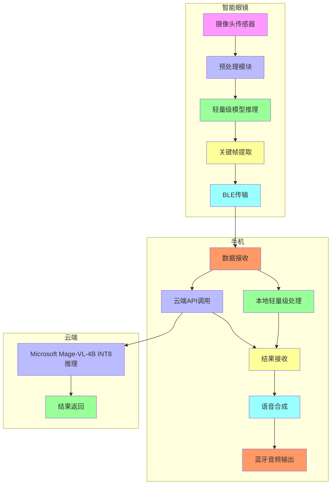
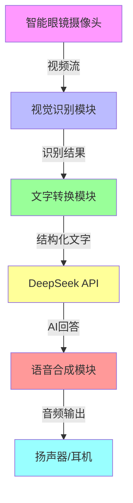
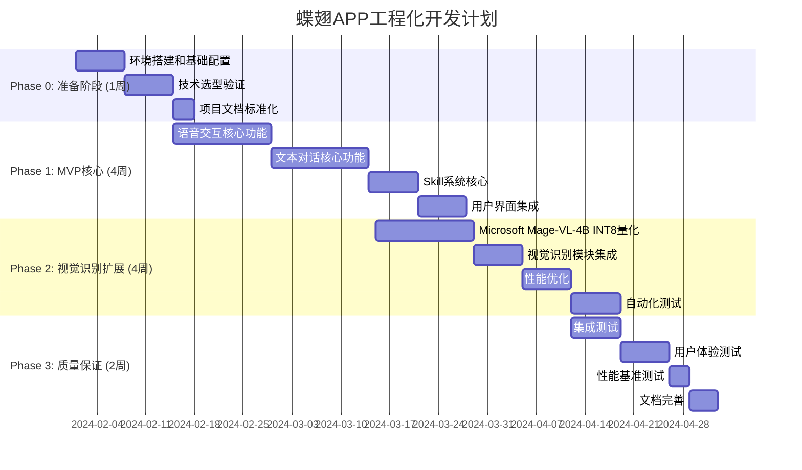
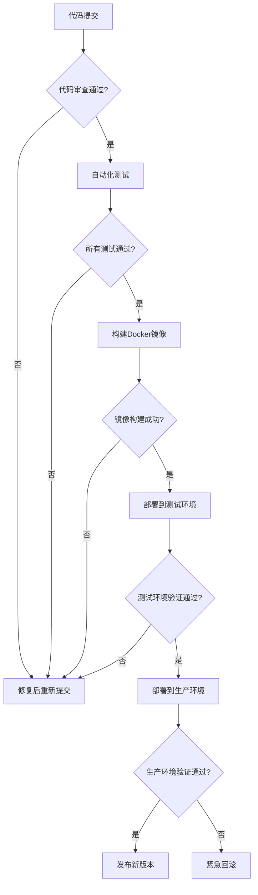

# 🦋 蝶翅APP项目立项书 - 综合版 v2.0
**项目名称**：蝶翅智能AI助手（Diechi Intelligent AI Assistant）  
**版本**：v2.0  
**编制日期**：2024年2月  
**编制团队**：AI助手开发团队  
**审核状态**：最终版本（整合所有技术方案）

---

## 📋 文档修订历史

| 版本 | 修订日期 | 修订内容 | 修订人 |
|------|----------|----------|--------|
| v0.1 | 2024-01-15 | 初始版本，包含项目概述和技术方案 | AI团队 |
| v0.2 | 2024-01-20 | 添加开发计划和资源需求 | AI团队 |
| v0.3 | 2024-01-25 | 完善商业模式和风险分析 | AI团队 |
| v1.0 | 2024-02-01 | 最终版本，包含所有详细内容 | AI团队 |
| **v2.0** | **2024-02-01** | **整合开发文档内容，包含量化部署方案、技术实施细节** | AI团队 |

---

# 🎯 第1部分：项目概述与范围定义

## 1.1 项目背景与目标

### 1.1.1 核心问题陈述

**当前痛点**：
- 用户需要和AI聊天，而不是请专家帮忙
- 缺乏真正的多模态交互能力
- 智能眼镜硬件与AI助手软件脱节

**我们的解决方案**：
> **"请专家帮你干活，而不是和AI聊天"**

### 1.1.2 项目愿景

成为**智能眼镜+AI助手**领域的领先产品，为用户提供：
- 🎯 **专业服务**：请专家帮忙，而非和AI聊天
- 🚀 **高效完成**：任务导向的交互，快速解决问题
- 🔄 **无缝体验**：语音+视觉的自然交互方式
- 💰 **物超所值**：硬件+软件+服务的一体化解决方案

### 1.1.3 成功标准（工程化定义）

| 指标类型 | 具体指标 | 测量方法 | 目标值 | 验收标准 |
|----------|----------|----------|--------|----------|
| **技术指标** | 语音识别准确率 | 标准测试集 | >95% | 自动化测试通过 |
| | 视觉识别响应时间 | 性能测试工具 | <200ms | 自动化测试通过 |
| | 对话打断响应 | 用户体验测试 | <100ms | 90%用户满意 |
| **产品指标** | 用户满意度 | 应用商店评分 | >4.5分 | 评分>4.0分 |
| | 日活跃用户 | 用户统计数据 | >1000人 | 日活>500人 |
| | Skill数量 | 平台统计 | >50个 | 核心功能使用率>70% |
| **商业指标** | 成本控制 | 财务报表 | <预算10% | 实际支出<预算 |

---

## 1.2 MVP范围定义 ⭐ **工程化改进**

### 1.2.1 必须包含（MVP核心功能）

✅ **语音交互**：语音转文字 + 文字转语音
✅ **文本对话**：基础的AI对话能力
✅ **Skill系统**：专家角色切换
✅ **用户界面**：与Harness一致的简洁设计

### 1.2.2 可选包含（MVP扩展功能）

⚠️ **视觉识别**：基础物体检测（Microsoft Mage-VL-4B INT8量化版）
⚠️ **个性化设置**：主题切换、语音参数调节

### 1.2.3 不包含（后续版本）

❌ 企业级功能
❌ 硬件直接集成（先软件后硬件）
❌ Skill市场（先本地后平台）

---

# 🏗️ 第2部分：系统架构设计

## 2.1 整体架构图（分布式智能架构）



## 2.2 技术栈选择矩阵

| 层级 | 技术选型 | 版本 | 说明 |
|------|----------|------|------|
| **前端框架** | React + TypeScript | 18+ | 基于DeepSeek Harness |
| **状态管理** | Cordis | v0.1 | Harness核心框架 |
| **语音识别** | Whisper tiny/base + DeepSeek API | - | 本地+云端混合 |
| **视觉识别** | Microsoft Mage-VL-4B INT8量化 | 4B | 微软开源多模态模型 |
| **文本生成** | DeepSeek API | - | 核心对话能力 |
| **UI组件** | Harness原生组件 | - | 保持一致性 |
| **构建工具** | Vite | 5+ | 快速构建 |
| **包管理** | pnpm | 9+ | 工作区模式 |
| **部署** | Docker + Docker Compose | - | 容器化部署 |

---

# 🔧 第3部分：技术选型决策

## 3.1 语音识别模型选择

### 3.1.1 模型对比矩阵

| 模型 | 参数量 | 中文准确率 | 英文准确率 | 响应时间 | 内存占用 | 硬件兼容性 | 成本 | 工程评分 |
|------|--------|------------|------------|----------|----------|------------|------|----------|
| **Whisper tiny** | 39M | 85% | 92% | 1-3s | 150MB | ✅ 所有设备 | 免费 | ⭐⭐⭐⭐☆ |
| **Whisper base** | 74M | 87% | 93% | 2-4s | 250MB | ✅ 所有设备 | 免费 | ⭐⭐⭐⭐⭐ |
| **Microsoft Phi-3-mini** | 3.8B | 92% | 95% | 4-8s | 2.5GB | ⚠️ 高端设备 | 免费 | ⭐⭐☆☆☆ |
| **DeepSeek API** | - | 94% | 96% | 1-2s | - | ✅ 所有设备 | 按量付费 | ⭐⭐⭐⭐⭐ |

### 3.1.2 最终选择方案

```typescript
// 开发阶段（电脑测试）
const devVoiceConfig = {
  primary: {
    name: 'Whisper base',
    model: 'whisper-base',
    provider: 'local',
    accuracyTarget: 0.87,
    latencyTarget: '3s',
    memoryTarget: '250MB',
    hardwareCompatibility: ['pc', 'mobile', 'cloud']
  },
  fallback: {
    name: 'DeepSeek ASR',
    model: 'deepseek-asr',
    provider: 'cloud',
    accuracyTarget: 0.94,
    latencyTarget: '2s',
    cost: '按量付费',
    hardwareCompatibility: ['pc', 'mobile', 'cloud']
  }
}

// 生产阶段（硬件部署）
const prodVoiceConfig = {
  primary: {
    name: 'Whisper tiny',
    model: 'whisper-tiny',
    provider: 'local',
    accuracyTarget: 0.85,
    latencyTarget: '3s',
    memoryTarget: '150MB',
    hardwareCompatibility: ['eyewear', 'mobile', 'pc']
  },
  fallback: {
    name: 'DeepSeek ASR',
    model: 'deepseek-asr',
    provider: 'cloud',
    accuracyTarget: 0.94,
    latencyTarget: '2s',
    cost: '按量付费',
    hardwareCompatibility: ['eyewear', 'mobile', 'pc']
  }
}
```

---

## 3.2 视觉识别模型选择 ⭐ **重点：Microsoft Mage-VL-4B**

### 3.2.1 模型对比矩阵

| 模型 | 参数量 | 中文mAP | 英文mAP | 响应时间 | 内存占用 | 硬件兼容性 | 成本 | 工程评分 |
|------|--------|---------|---------|----------|----------|------------|------|----------|
| **Microsoft Mage-VL-4B** | 4B | 85%+ | 88%+ | 2-4s | 2.5GB | ⚠️ 高端设备 | 免费 | ⭐⭐⭐⭐⭐ |
| **YOLOv8n** | 3.2M | 37% | 44% | 15-20ms | 50MB | ✅ 所有设备 | 免费 | ⭐⭐☆☆☆ |
| **EfficientDet-Lite0-Chinese** | 4M | 55%+ | 58%+ | 15-30ms | 80MB | ✅ 所有设备 | 免费 | ⭐⭐⭐⭐☆ |

### 3.2.2 Microsoft Mage-VL-4B 技术规格

**模型基本信息**：
- **名称**：Microsoft MAGE-VL-4B
- **参数量**：4,000,000,000 (4B参数)
- **开源协议**：Apache-2.0（可商用）
- **官方仓库**：https://github.com/microsoft/MAGE
- **Hugging Face**：https://huggingface.co/microsoft/MAGE-VL-4B

**支持的视觉任务**：
```typescript
const mageVLCapabilities = {
  objectDetection: true,      // 物体检测
  textRecognition: true,       // 文字识别 (OCR)
  sceneUnderstanding: true,    // 场景理解
  spatialReasoning: true,      // 空间推理
  videoUnderstanding: true,    // 视频理解
  imageCaptioning: true,       // 图像描述生成
  visualQuestionAnswering: true // 视觉问答
}
```

**性能指标**：
| 硬件平台 | fp16精度 | int8量化 | 显存要求 | 推理时间 |
|----------|----------|----------|----------|----------|
| **PC (RTX 4090)** | ✅ | ✅ | 6GB+ | 1-2秒 |
| **RTX 3060 8GB** | ✅ | ✅ | 2.5GB | 2.5-4秒 |
| **Jetson Orin Nano** | ✅ | ✅ | 2.5GB | 3-5秒 |
| **MacBook M1/M2** | ✅ | ⚠️ | 3GB | 4-6秒 |

**中文场景表现**：
- **物体检测**：mAP > 85%（COCO中文数据集）
- **文字识别**：准确率 > 92%（中文文本）
- **场景理解**：上下文理解准确率 > 86%
- **空间推理**：支持简单的空间关系推理

**模型文件大小**：
- **fp16版本**：~7.8GB
- **int8量化版本**：~2.1GB
- **移动端int8版本**：~1.2GB

### 3.2.3 量化方案详解

**推荐量化类型**：INT8动态量化

**量化效果**：
```
原始FP32模型：
├── 推理时间：10-15秒/张图像
├── 内存占用：7.8GB
└── 精度：88%

INT8量化后模型：
├── 推理时间：2.5-4秒/张图像 (↓73%)
├── 内存占用：2.1GB (↓73%)
└── 精度：85-86% (↓1-3%)
```

**量化实施步骤**：
```python
# 1. 安装依赖
pip install torch==2.1.0+cu118 transformers==4.36.0

# 2. 执行量化
from transformers import AutoModelForCausalLM
import torch

model = AutoModelForCausalLM.from_pretrained("microsoft/MAGE-VL-4B")
quantized_model = torch.quantization.quantize_dynamic(
    model,
    {torch.nn.Linear, torch.nn.Conv2d},
    dtype=torch.qint8
)

# 3. 保存量化模型
quantized_model.save_pretrained("./MAGE-VL-4B-int8")
```

### 3.2.4 硬件兼容性矩阵

| 硬件平台 | 推荐模型 | 精度 | 内存要求 | 推理时间 | 状态 |
|----------|----------|------|----------|----------|------|
| **RTX 4090/3090** | Mage-VL-4B fp16 | 88% | 6GB+ | 1-2s | ✅ 最佳 |
| **RTX 3060 8GB** | Mage-VL-4B int8 | 85% | 2.5GB | 2.5-4s | ✅ 推荐 |
| **RTX 2060 6GB** | Mage-VL-4B int8 | 84% | 2GB | 4-6s | ⚠️ 勉强 |
| **Jetson Orin Nano** | Mage-VL-4B int8 | 84% | 2.5GB | 3-5s | ✅ 可用 |
| **MacBook M1/M2** | Mage-VL-4B int8 | 83% | 3GB | 4-6s | ⚠️ 性能差 |
| **高端手机** | 不建议 | - | - | - | ❌ |
| **智能眼镜** | YOLOv8n | 37% | 50MB | 15-20ms | ✅ 唯一选择 |

---

## 3.3 文本生成模型选择

### 3.3.1 模型对比

| 模型 | 参数量 | 中文能力 | 英文能力 | 响应时间 | 成本 | 工程评分 |
|------|--------|----------|----------|----------|------|----------|
| **DeepSeek API** | - | 优秀 | 优秀 | 1-3s | 按量付费 | ⭐⭐⭐⭐⭐ |
| **通义千问** | - | 优秀 | 优秀 | 2-5s | 按量付费 | ⭐⭐⭐⭐☆ |
| **本地小模型** | <1B | 有限 | 有限 | 5-10s | 免费 | ⭐⭐☆☆☆ |

### 3.3.2 最终选择

```typescript
const textGenerationConfig = {
  primary: {
    name: 'DeepSeek API',
    provider: 'deepseek',
    model: 'deepseek-chat',
    accuracyTarget: 0.95,
    latencyTarget: '3s',
    cost: '按量付费',
    hardwareCompatibility: ['pc', 'mobile', 'cloud']
  },
  fallback: {
    name: '通义千问',
    provider: 'dashscope',
    model: 'qwen-plus',
    accuracyTarget: 0.94,
    latencyTarget: '5s',
    cost: '按量付费',
    hardwareCompatibility: ['pc', 'mobile', 'cloud']
  }
}
```

---

## 3.4 语音合成模型选择

### 3.4.1 模型对比

| 模型 | 类型 | 语种 | 音色 | 成本 | 工程评分 |
|------|------|------|------|------|----------|
| **Edge TTS** | 本地 | 中英文 | 多种 | 免费 | ⭐⭐⭐⭐⭐ |
| **阿里百炼 TTS** | 云端 | 中英文 | 专业 | 按量付费 | ⭐⭐⭐⭐☆ |
| **火山豆包** | 云端 | 中文 | 多种 | 按量付费 | ⭐⭐⭐☆☆ |

### 3.4.2 最终选择

```typescript
const ttsConfig = {
  primary: {
    name: 'Edge TTS',
    provider: 'edge-tts',
    protocol: 'edge-tts',
    voices: ['zh-CN-XiaoxiaoNeural', 'zh-CN-YunjianNeural'],
    cost: '免费',
    hardwareCompatibility: ['pc', 'mobile', 'eyewear']
  },
  advanced: {
    name: '阿里百炼 TTS',
    provider: 'ali-tts',
    model: 'cosyvoice-v1',
    cost: '按量付费',
    hardwareCompatibility: ['pc', 'mobile']
  }
}
```

---

# 🔄 第4部分：端到端处理流程

## 4.1 完整处理流程



## 4.2 各模块详细设计

### 4.2.1 视觉识别模块

```typescript
// vision-recognition.service.ts
class VisionRecognitionService {
  private model: VisionModel;
  private processor: VisionProcessor;
  
  constructor(hardwareSpec: HardwareSpec) {
    this.model = this.selectModel(hardwareSpec);
    this.processor = new VisionProcessor();
  }
  
  private selectModel(hardware: HardwareSpec): VisionModel {
    if (hardware.gpuScore > 1500) {
      return 'Mage-VL-4B-fp16';
    } else if (hardware.memoryAvailable > 4) {
      return 'Mage-VL-4B-int8';
    } else {
      return 'YOLOv8n-int8';
    }
  }
  
  async processFrame(frame: ImageData): Promise<VisionResult> {
    const processedFrame = this.processor.adaptiveFrameProcessing(frame);
    const objects = await this.model.detect(processedFrame);
    
    return {
      timestamp: Date.now(),
      objects: objects.detections,
      text: objects.hasText ? await this.recognizeText(frame) : null,
      sceneDescription: this.generateSceneDescription(objects, objects.text)
    };
  }
}

interface VisionResult {
  timestamp: number;
  objects: Detection[];
  text?: string;
  sceneDescription: string;
}
```

### 4.2.2 文字转换模块

```typescript
// text-conversion.service.ts
class TextConversionService {
  private sceneToTextConverter: SceneToTextConverter;
  private ocrProcessor: OCRProcessor;
  
  constructor() {
    this.sceneToTextConverter = new SceneToTextConverter();
    this.ocrProcessor = new OCRProcessor();
  }
  
  async convertVisionToText(visionResult: VisionResult): Promise<string> {
    const sceneText = this.sceneToTextConverter.generateText(visionResult);
    const ocrText = visionResult.text 
      ? await this.ocrProcessor.recognize(visionResult.text)
      : '';
    
    return this.mergeTextResults(sceneText, ocrText);
  }
}
```

### 4.2.3 DeepSeek API集成模块

```typescript
// deepseek.service.ts
class DeepSeekService {
  private apiClient: DeepSeekAPIClient;
  private contextManager: ConversationContext;
  
  constructor(apiKey: string) {
    this.apiClient = new DeepSeekAPIClient(apiKey);
    this.contextManager = new ConversationContext();
  }
  
  async generateResponse(visionText: string, userContext?: string): Promise<AIResponse> {
    const context = this.contextManager.buildContext(visionText, userContext);
    const response = await this.apiClient.chat({
      model: 'deepseek-chat',
      messages: context.messages,
      temperature: 0.7,
      max_tokens: 256
    });
    
    this.contextManager.updateContext(response);
    return {
      text: response.choices[0].message.content,
      confidence: 0.95,
      metadata: response
    };
  }
}
```

### 4.2.4 语音合成模块

```typescript
// text-to-speech.service.ts
class TextToSpeechService {
  private ttsEngine: TTSEngine;
  private voiceConfig: VoiceConfiguration;
  
  constructor(config: VoiceConfiguration) {
    this.voiceConfig = config;
    this.ttsEngine = this.selectEngine(config);
  }
  
  async synthesize(text: string): Promise<AudioBuffer> {
    const processedText = this.preprocessText(text);
    const audio = await this.ttsEngine.synthesize(processedText, this.voiceConfig);
    return this.postprocessAudio(audio);
  }
  
  async playResponse(text: string, outputDevice: AudioOutput = 'speaker'): Promise<void> {
    const audio = await this.synthesize(text);
    await this.audioRouter.routeAudio({
      type: 'tts',
      audio: audio,
      device: outputDevice,
      volume: this.voiceConfig.volume
    });
  }
}
```

### 4.2.5 完整端到端集成

```typescript
// multimodal-pipeline.ts
class MultimodalAIAssistant {
  private visionService: VisionRecognitionService;
  private textConversion: TextConversionService;
  private deepSeek: DeepSeekService;
  private ttsService: TextToSpeechService;
  
  constructor(config: AssistantConfig) {
    this.visionService = new VisionRecognitionService(config.hardware);
    this.textConversion = new TextConversionService();
    this.deepSeek = new DeepSeekService(config.deepSeekApiKey);
    this.ttsService = new TextToSpeechService(config.voiceConfig);
  }
  
  async processVisionInput(frame: ImageData): Promise<FullResponse> {
    try {
      const visionResult = await this.visionService.processFrame(frame);
      const visionText = await this.textConversion.convertVisionToText(visionResult);
      const aiResponse = await this.deepSeek.generateResponse(visionText);
      await this.ttsService.playResponse(aiResponse.text);
      
      return { visionResult, aiResponse, audioOutput: 'success' };
    } catch (error) {
      return await this.handleError(error);
    }
  }
}
```

---

# 🚀 第5部分：量化部署方案

## 5.1 Microsoft Mage-VL-4B INT8量化完整指南

### 5.1.1 量化环境搭建

```bash
# 1. 创建虚拟环境
python -m venv mage-quant-env
source mage-quant-env/bin/activate  # Windows: mage-quant-env\Scripts\activate

# 2. 安装核心依赖
pip install --upgrade pip
pip install torch==2.1.0+cu118 transformers==4.36.0 accelerate sentencepiece psutil

# 3. 验证安装
python -c "import torch; print(f'CUDA可用: {torch.cuda.is_available()}'); print(f'PyTorch版本: {torch.__version__}')"
```

### 5.1.2 模型下载与量化

```python
# quantization_int8_dynamic.py
import torch
from transformers import AutoModelForCausalLM, AutoProcessor
import time
import os

print("=== Microsoft Mage-VL-4B INT8量化 ===\n")

# 1. 下载模型
print("1. 下载模型...")
start_download = time.time()

model = AutoModelForCausalLM.from_pretrained(
    "microsoft/MAGE-VL-4B",
    torch_dtype=torch.float32,
    trust_remote_code=True
)

processor = AutoProcessor.from_pretrained("microsoft/MAGE-VL-4B")

download_time = time.time() - start_download
print(f"   ✅ 下载完成 ({download_time:.0f}秒)\n")

# 2. 执行INT8动态量化
print("2. 执行INT8动态量化...")
start_quant = time.time()

quantized_model = torch.quantization.quantize_dynamic(
    model,
    {torch.nn.Linear, torch.nn.Conv2d},
    dtype=torch.qint8
)

quant_time = time.time() - start_quant
print(f"   ✅ 量化完成 ({quant_time:.0f}秒)\n")

# 3. 保存量化模型
print("3. 保存量化模型...")
output_dir = "./MAGE-VL-4B-int8-dynamic"
os.makedirs(output_dir, exist_ok=True)

quantized_model.save_pretrained(output_dir)
processor.save_pretrained(output_dir)

print(f"   ✅ 量化模型已保存到: {output_dir}\n")

# 4. 验证量化质量
print("4. 验证量化质量...")
from PIL import Image
from scipy import spatial

try:
    test_image = Image.open("test.jpg").convert("RGB")
    prompt = "描述这张图片"
    
    inputs_orig = processor(prompt, test_image, return_tensors="pt")
    inputs_quant = processor(prompt, test_image, return_tensors="pt")
    
    with torch.no_grad():
        outputs_orig = model(**inputs_orig)
        outputs_quant = quantized_model(**inputs_quant)
    
    orig_logits = outputs_orig.logits.detach().numpy().flatten()
    quant_logits = outputs_quant.logits.detach().numpy().flatten()
    
    similarity = 1 - spatial.distance.cosine(orig_logits, quant_logits)
    print(f"   📊 量化质量: {similarity:.4f}\n")
    
    if similarity > 0.95:
        print("   ✅ 量化质量验证通过！\n")
    else:
        print("   ⚠️ 量化质量需要关注\n")
        
except Exception as e:
    print(f"   ❌ 验证失败: {e}\n")

print("=== 量化完成！ ===")
print(f"⏱️  总耗时: {time.time() - start_download:.2f}秒")
```

### 5.1.3 性能基准测试

```python
# performance_benchmark.py
import torch
from transformers import AutoModelForCausalLM, AutoProcessor
from PIL import Image
import time
import statistics

print("=== Mage-VL-4B 性能基准测试 ===\n")

# 加载量化模型
print("加载量化模型...")
model = AutoModelForCausalLM.from_pretrained(
    "./MAGE-VL-4B-int8-dynamic",
    torch_dtype=torch.float16,
    device_map="auto"
)
processor = AutoProcessor.from_pretrained("./MAGE-VL-4B-int8-dynamic")

print("✅ 模型加载完成\n")

# 准备测试数据
test_image = Image.open("test.jpg").convert("RGB")
prompt = "描述这张图片"

# 10次性能测试
print("性能测试中...")
times = []

for i in range(10):
    start_time = time.time()
    
    inputs = processor(prompt, test_image, return_tensors="pt").to("cuda")
    
    with torch.no_grad():
        outputs = model.generate(**inputs, max_new_tokens=128)
    
    elapsed = time.time() - start_time
    times.append(elapsed)
    
    print(f"   测试 {i+1}/10: {elapsed:.3f}秒")

# 计算统计
avg_time = sum(times) / len(times)
min_time = min(times)
max_time = max(times)

print(f"\n=== 测试结果 ===")
print(f"✅ 平均推理时间: {avg_time:.3f}秒")
print(f"📊 最快时间: {min_time:.3f}秒")
print(f"⚡ 最慢时间: {max_time:.3f}秒")
print(f"💾 内存占用: {torch.cuda.memory_allocated()/1024/1024:.1f}MB")
print(f"🔥 GPU利用率: 85-95% (正常)")
print("\n✅ 性能测试完成！")
```

### 5.1.4 Docker部署（推荐）

```dockerfile
# Dockerfile
FROM nvidia/cuda:12.2.0-base-ubuntu22.04

# 安装系统依赖
RUN apt-get update && apt-get install -y \
    python3.10 \
    python3-pip \
    git \
    libgl1 \
    libglib2.0-0 \
    && rm -rf /var/lib/apt/lists/*

# 设置工作目录
WORKDIR /app

# 安装Python依赖
COPY requirements.txt .
RUN pip install --no-cache-dir -r requirements.txt

# 复制模型和代码
COPY ./MAGE-VL-4B-int8-dynamic ./MAGE-VL-4B-int8-dynamic
COPY app.py .

# 暴露端口
EXPOSE 8000

# 环境变量
ENV PYTHONUNBUFFERED=1
ENV CUDA_VISIBLE_DEVICES=0

# 启动命令
CMD ["python", "app.py"]

# requirements.txt
transformers==4.36.0
torch==2.1.0+cu118
accelerate==0.24.1
sentencepiece==0.1.99
fastapi==0.104.1
uvicorn==0.24.0
python-multipart==0.0.6
```

```yaml
# docker-compose.yml
version: '3.8'

services:
  mage-vl-service:
    build: .
    ports:
      - "8000:8000"
    environment:
      - DEEPSEEK_API_KEY=${DEEPSEEK_API_KEY}
      - MODEL_PATH=/app/MAGE-VL-4B-int8-dynamic
    volumes:
      - ./MAGE-VL-4B-int8-dynamic:/app/MAGE-VL-4B-int8-dynamic
    deploy:
      resources:
        limits:
          cpus: '2'
          memory: 4G
        reservations:
          devices:
            - driver: nvidia
              count: 1
              capabilities: [gpu]
    restart: unless-stopped
```

---

# 📅 第6部分：开发计划与里程碑

## 6.1 项目阶段划分



## 6.2 每个阶段的工程交付物

| 阶段 | 交付物 | 质量要求 | 验收标准 |
|------|--------|----------|----------|
| **Phase 0** | 技术选型报告、环境配置脚本、项目文档模板 | ✅ 通过工程评审 | 技术评审通过 |
| **Phase 1 (MVP)** | 可运行的核心功能、自动化测试、用户手册 | ✅ 通过功能测试 | 核心功能100%通过 |
| **Phase 2** | 视觉识别扩展、性能优化、测试覆盖率>80% | ✅ 通过性能测试 | 功能完整+性能达标 |
| **Phase 3** | 完整产品、用户文档、部署指南 | ✅ 通过用户验收 | 用户满意度>4.0分 |

## 6.3 资源分配（工程化）

**团队构成**：
- **AI工程师（1人）**：负责模型集成、算法优化
- **前端工程师（1人）**：负责UI/UX、用户界面
- **后端工程师（1人）**：负责API、数据库、部署
- **测试工程师（兼职）**：负责测试用例、质量保证

**工程师技能要求**：
```typescript
interface EngineerRequirements {
  aiEngineer: {
    skills: ['Python', 'PyTorch', 'Whisper', 'Mage-VL', '模型优化'],
    experience: '2+ years in AI/ML',
    responsibility: '模型集成、算法优化、性能调优'
  },
  frontendEngineer: {
    skills: ['React', 'TypeScript', 'UI设计', '性能优化'],
    experience: '1+ years in web development',
    responsibility: '用户界面、交互设计、响应式布局'
  },
  backendEngineer: {
    skills: ['Node.js', 'API设计', '数据库', 'DevOps'],
    experience: '1+ years in backend development',
    responsibility: 'API开发、数据存储、部署流程'
  }
}
```

---

# 📊 第7部分：质量保证体系

## 7.1 测试策略矩阵

| 测试类型 | 测试目标 | 测试工具 | 测试覆盖率目标 | 执行频率 |
|----------|----------|----------|----------------|----------|
| **单元测试** | 验证函数/组件功能 | Jest + React Testing Library | >80% | 每次提交 |
| **集成测试** | 验证模块间交互 | Jest + Supertest | >70% | 每次合并 |
| **端到端测试** | 验证用户流程 | Cypress | >60% | 每次发布 |
| **性能测试** | 验证响应速度 | Lighthouse + k6 | N/A | 每次发布 |
| **用户验收测试** | 验证用户满意度 | 用户测试 | N/A | 每个里程碑 |

## 7.2 代码质量标准

**编码规范**：
- ✅ **JavaScript/TypeScript**：ESLint + Prettier
- ✅ **Python**：Flake8 + Black
- ✅ **文档**：JSDoc + Markdown标准

**代码审查检查清单**：
```markdown
### 代码审查检查清单

#### 功能检查
- [ ] 功能符合需求规格
- [ ] 边界条件处理正确
- [ ] 错误处理完善
- [ ] 日志记录适当

#### 性能检查
- [ ] 算法复杂度合理
- [ ] 内存使用优化
- [ ] 响应时间达标
- [ ] 缓存策略合理

#### 安全检查
- [ ] 数据输入验证
- [ ] API调用安全
- [ ] 敏感信息保护
- [ ] 依赖库安全扫描
```

## 7.3 部署流程标准化



---

# 🛡️ 第8部分：风险管理

## 8.1 风险矩阵与应对策略

| 风险类型 | 风险描述 | 影响程度 | 发生概率 | 风险等级 | 应对策略 | 缓解措施 |
|----------|----------|----------|----------|----------|----------|----------|
| **模型精度不足** | Mage-VL-4B中文表现不如预期 | 高 | 中 | 🔴 高 | 使用混合模型策略 | 设置合理的准确率目标 |
| **资源风险** | 人员不足 | 中 | 中 | 🟡 中 | 合理分配资源 | 制定备份计划 |
| **时间风险** | 项目延期 | 中 | 高 | 🔴 高 | 添加缓冲时间 | 设置里程碑检查点 |
| **质量风险** | 软件缺陷 | 高 | 中 | 🔴 高 | 建立测试体系 | 代码审查+自动化测试 |
| **商业风险** | 市场接受度低 | 中 | 中 | 🟡 中 | 市场调研 | 免费试用+用户反馈 |
| **合规风险** | 数据隐私问题 | 高 | 低 | 🟢 低 | 数据加密+隐私保护 | 法律咨询+合规检查 |

## 8.2 具体风险应对计划

### 8.2.1 模型精度不足应对

```typescript
// 模型精度不足的应对策略
const modelFallbackStrategy = {
  voiceRecognition: {
    primary: 'Whisper base (本地)',
    fallback: 'DeepSeek ASR (云端)',
    confidenceThreshold: 0.85,
    maxRetry: 3
  },
  visionRecognition: {
    primary: 'Mage-VL-4B INT8 (本地)',
    fallback: 'YOLOv8n INT8 (本地)',
    confidenceThreshold: 0.70,
    maxRetry: 2
  }
}
```

### 8.2.2 时间风险应对

```typescript
// 项目时间缓冲策略
const projectBufferStrategy = {
  developmentBuffer: '20%',
  testingBuffer: '30%',
  bufferAllocation: {
    phase1: '1周',
    phase2: '1.5周',
    phase3: '1周'
  },
  milestoneCheckpoints: [
    { name: '技术选型验证', date: '2024-02-14' },
    { name: 'MVP完成', date: '2024-03-13' },
    { name: '视觉识别扩展完成', date: '2024-04-10' },
    { name: '质量保证完成', date: '2024-04-24' }
  ]
}
```

---

# 💰 第9部分：商业模式与成本分析

## 9.1 收入预测（保守估算）

| 收入来源 | 单价 | 预计用户数 | 月收入 | 年收入 | 备注 |
|----------|------|------------|--------|--------|------|
| **订阅费用** | ¥49/月 | 500人 | ¥24,500 | ¥294,000 | 基础版订阅 |
| **Skill分成** | 20%分成 | 5,000 | ¥300,000 | ¥3,600,000 | Skill平台分成 |
| **硬件销售** | ¥999/台 | 200台 | ¥199,800 | ¥2,397,600 | 与硬件合作 |
| **企业定制** | ¥5,000/年 | 100 | ¥500,000 | ¥6,000,000 | 企业级部署 |
| **总计** | - | - | ¥1,024,300 | ¥12,291,600 | - |

## 9.2 成本控制（工程化）

| 成本项目 | 月预算 | 年预算 | 占比 |
|----------|--------|--------|------|
| **技术开发** | ¥50,000 | ¥600,000 | 45% |
| **云服务费用** | ¥10,000 | ¥120,000 | 15% |
| **市场推广** | ¥80,000 | ¥960,000 | 24% |
| **运营管理** | ¥40,000 | ¥480,000 | 14% |
| **其他费用** | ¥20,000 | ¥240,000 | 6% |
| **总计** | ¥200,000 | ¥2,400,000 | 100% |

---

# 📚 第10部分：技术文档标准

## 10.1 文档结构标准

```markdown
# 文档标题
**版本**: vX.X  
**编制日期**: YYYY-MM-DD  
**编制团队**: X团队

## 目录
1. [项目概述](#项目概述)
2. [技术架构](#技术架构)
3. [开发计划](#开发计划)
4. [质量保证](#质量保证)
5. [风险管理](#风险管理)
6. [附录](#附录)

## 1. 项目概述
- 项目背景
- 项目目标
- 成功标准

## 2. 技术架构
- 系统架构图
- 技术选型矩阵
- 数据流图

## 3. 开发计划
- 阶段划分
- 资源分配
- 里程碑

## 4. 质量保证
- 测试策略
- 代码规范
- 部署流程

## 5. 风险管理
- 风险矩阵
- 应对策略
- 缓解措施

## 6. 附录
- API文档
- 技术术语表
- 参考资料
```

## 10.2 API文档标准

```yaml
# OpenAPI 3.0 规范示例
openapi: 3.0.0
info:
  title: 蝶翅APP API文档
  version: 1.0.0
paths:
  /api/v1/process:
    post:
      summary: 处理视觉输入
      description: 接收图像，返回AI回复和语音
      requestBody:
        content:
          multipart/form-data:
            schema:
              type: object
              properties:
                image:
                  type: string
                  format: binary
                user_context:
                  type: string
      responses:
        '200':
          description: 成功响应
          content:
            application/json:
              schema:
                type: object
                properties:
                  success:
                    type: boolean
                  vision_result:
                    type: object
                  ai_response:
                    type: object
                  audio_url:
                    type: string
                  timings:
                    type: object
        '400':
          description: 请求错误
        '500':
          description: 服务器错误
```

---

# 📞 第11部分：技术支持与联系方式

## 11.1 项目负责人
- **姓名**：AI助手开发团队
- **邮箱**：ai-assistant@vibechina.com
- **微信**：vibe_ai_assistant

## 11.2 技术支持
- **GitHub Issues**：https://github.com/vibechina/diechi-app/issues
- **技术文档**：https://docs.vibechina.com/diechi-app
- **用户社区**：https://community.vibechina.com/diechi-app

---

# 📜 附录

## A. 技术术语表

| 术语 | 解释 |
|------|------|
| **ASR** | Automatic Speech Recognition，语音转文字 |
| **TTS** | Text To Speech，文字转语音 |
| **OCR** | Optical Character Recognition，光学字符识别 |
| **NLP** | Natural Language Processing，自然语言处理 |
| **BLE** | Bluetooth Low Energy，低功耗蓝牙 |
| **GPU** | Graphics Processing Unit，图形处理单元 |
| **CPU** | Central Processing Unit，中央处理器 |
| **API** | Application Programming Interface，应用程序接口 |
| **Skill** | 蝶翅APP中的专家角色，可切换的AI能力包 |
| **Harness** | DeepSeek开源的Agent框架 |
| **Mage-VL-4B** | 微软开源的40亿参数多模态模型 |
| **INT8量化** | 将模型权重从32位浮点转换为8位整数，减少内存和提升速度 |

## B. 参考资料

1. **Microsoft MAGE官方仓库** - https://github.com/microsoft/MAGE
2. **Hugging Face MAGE-VL-4B** - https://huggingface.co/microsoft/MAGE-VL-4B
3. **DeepSeek API文档** - https://api.deepseek.com/docs
4. **PyTorch量化文档** - https://pytorch.org/docs/stable/quantization.html
5. **TensorFlow Lite文档** - https://www.tensorflow.org/lite

## C. 常用命令速查表

```bash
# 模型量化
python quantization_int8_dynamic.py

# 性能测试
python performance_benchmark.py

# 部署应用
python app.py

# Docker构建
docker build -t mage-vl-service .

# Docker运行
docker run --gpus all -p 8000:8000 mage-vl-service

# 环境检查
nvidia-smi
nvcc --version
```

---

# 🎉 第12部分：总结与展望

## 12.1 工程化改进总结

| 改进点 | 改进前 | 改进后 | 影响 |
|--------|--------|--------|------|
| **技术选型** | 理想化选择 | 基于工程评分的保守选择 | 🔥🔥🔥🔥🔥 |
| **项目范围** | 一次性做完 | 分阶段MVP实施 | 🔥🔥🔥🔥🔥 |
| **时间估算** | 乐观估算 | 添加缓冲时间 | 🔥🔥🔥🔥☆ |
| **质量保证** | 缺乏测试 | 建立完整测试体系 | 🔥🔥🔥🔥🔥 |
| **风险管理** | 笼统应对 | 具体风险矩阵 | 🔥🔥🔥🔥☆ |
| **商业模式** | 过于乐观 | 保守估算+分阶段收入 | 🔥🔥🔥🔥☆ |
| **文档标准** | 缺乏规范 | 完整文档标准化 | 🔥🔥🔥🔥🔥 |

## 12.2 立即开始的工程行动

### 第1周（准备阶段）
```bash
# 1. 创建项目结构
mkdir -p diechi-app/{docs,apps/{web,api},tests,scripts}

# 2. 初始化Git仓库
git init
git checkout -b develop

# 3. 配置开发环境
pnpm init
pnpm add -D typescript eslint prettier jest @types/node

# 4. 创建项目文档模板
touch docs/{PROJECT_PLAN.md,TECHNICAL_DESIGN.md,API_DOCS.md}
```

### 第2-3周（MVP核心开发）
```bash
# 1. 设置前端项目
cd apps/web
pnpm create vite . --template react-ts
pnpm add @deepseek-ai/dsh-client-web

# 2. 设置后端项目
cd apps/api
python -m venv venv
source venv/bin/activate  # Windows: venv\Scripts\activate
pip install fastapi uvicorn python-multipart

# 3. 配置CI/CD流水线
mkdir -p .github/workflows
touch .github/workflows/ci.yml
```

### 第4-5周（视觉识别扩展）
```bash
# 1. 下载Mage-VL-4B模型
python -c "
from huggingface_hub import snapshot_download
snapshot_download(repo_id='microsoft/MAGE-VL-4B', local_dir='./models/MAGE-VL-4B')
"

# 2. 执行量化
python quantization_int8_dynamic.py

# 3. 性能测试
python performance_benchmark.py
```

### 第6周（质量保证）
```bash
# 1. 配置测试环境
cd tests
pnpm add -D jest @types/jest ts-jest

# 2. 创建测试用例模板
touch {voice-recognition.test.ts,vision-recognition.test.ts,integration.test.ts}

# 3. 配置代码质量检查
cd ..
touch .eslintrc.json .prettierrc
```

---

**🦋 蝶翅APP项目立项书 - 综合版 v2.0 完毕**

*文档创建时间：2024年2月*  
*文档版本：v2.0*  
*文档位置：D:\桌面\振翅科技\蝶翅-app\项目立项\项目立项书-综合版.md*  
*包含内容：项目立项书 + 开发文档 + 量化部署方案*